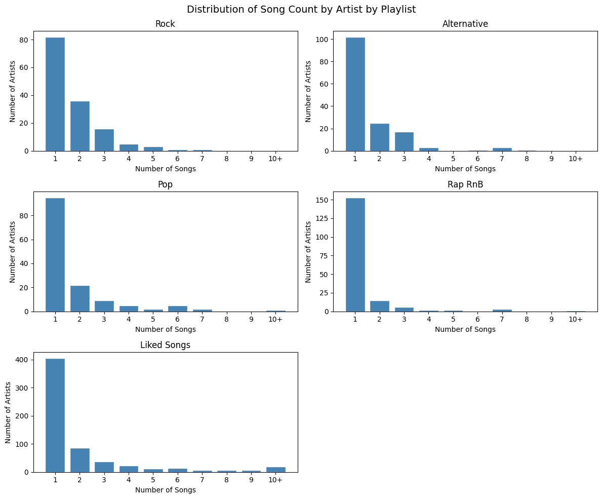
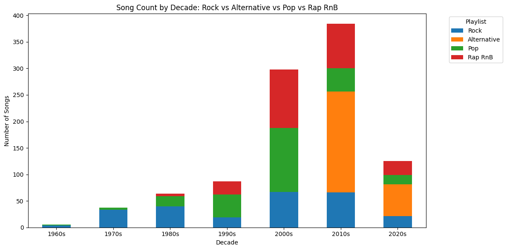
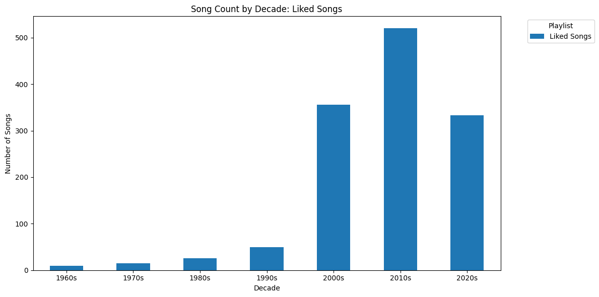
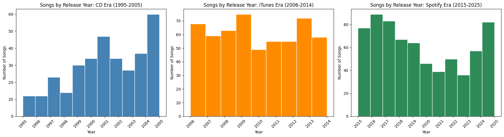

# music-taste-profile
Analyzing my Spotify music library using k-means clustering and nearest neighbors to map audio features and generate playlists. 

## Introduction

I wanted to understand my own music taste algorithmically — not through Spotify's black-box recommendations, but by clustering my library on audio features I could inspect and interpret.

**The dataset:** I started with four genre playlists (rock, pop, rap/R&B, 2010s alternative) of 250 songs each, plus my liked songs (~2,000 tracks). After deduplication and intersection, the working library contained **2,309 songs**.

**The features:** Spotify's audio descriptors plus metadata:

`BPM` · `Valence` · `Dance` · `Energy` · `Acoustic` · `Loud (Db)` · `Speech` · `Live` · `Time Signature` · `Album Year` · `Popularity`

## Methods

**Data preprocessing:** To prevent any single artist from dominating the clustering, I capped artist representation at 20 songs (approximately 1% of the library).

**Two approaches:**

1. **Nearest neighbors** — given a seed song, find similar tracks by audio feature distance. This answers: *"I like this song, what else sounds like it?"*

2. **K-means partitioning** — split a large playlist into smaller clusters using silhouette-optimized k. This answers: *"How does my library naturally group, and can I turn those groups into playlists?"*

| Notebook | Approach | Purpose |
|----------|----------|---------|
| `01_exploratory_analysis` | — | Artist/decade/popularity distributions, feature selection, correlation matrix, PCA |
| `02_knn_playlist_generator` | Nearest neighbors | Seed song retrieval and playlist generation |
| `03_partition_generator` | K-means partitioning | Automated playlist splitting with silhouette-optimized k selection |

## Results

### Library composition

The library contained **1,046 unique artists** across 2,309 songs.

| Playlist | Unique Artists |
|----------|----------------|
| Liked Songs | 618 |
| Rap/R&B | 182 |
| Alternative | 152 |
| Rock | 144 |
| Pop | 141 |

**Top 5 artists by song count:**

| Artist | Songs |
|--------|-------|
| Eminem | 20 |
| The Neighbourhood | 20 |
| Matt Maeson | 20 |
| Florence + The Machine | 20 |
| Maroon 5 | 18 |

*Figure 1: Artist frequency follows a long-tail distribution across all playlists — most artists contribute only 1–2 songs, with a small number contributing 10+.*

### Temporal distribution

The library skews heavily toward 2000s–2010s music, with the 2010s containing the most songs. 

| Decade | Songs |
|--------|-------|
| 1960s | 14 |
| 1970s | 52 |
| 1980s | 90 |
| 1990s | 137 |
| 2000s | 654 |
| 2010s | 904 |
| 2020s | 458 |

*Figure 2: Genre playlist breakdown by decade. Rock dominates pre-2000s; Alternative peaks in the 2010s.*

*Figure 3: Liked Songs by decade — peak in 2010s, with the 2020s (only halfway complete) nearly surpassing the entire 2000s.*

### Temporal distribution by era

The library reflects three distinct eras of music acquisition:

| Era | Years | Songs | Avg/Year | Range |
|-----|-------|-------|----------|-------|
| CD Era | 1995–2005 | 426 | 38.7 | 10–74 |
| iTunes Era | 2006–2014 | 701 | 77.9 | 62–94 |
| Spotify Era | 2015–2025 | 942 | 85.6 | 43–123 |

*Figure 4: Song count by release year, segmented by acquisition era. Average songs per year doubles from CD to iTunes, then continues climbing in the Spotify era.*

## Discussion 